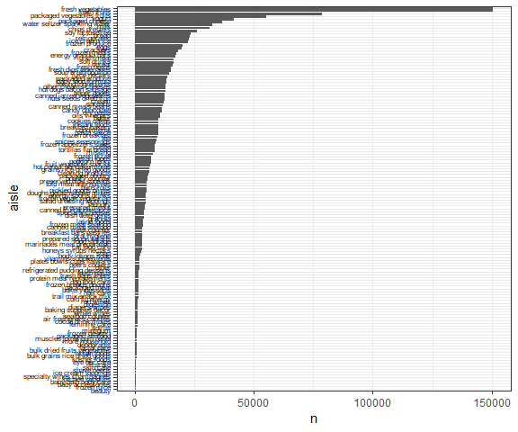

P8105 Homework 3
================
Quinton Neville
Due October 15th, 2018

Problem 1
=========

This problem uses the BRFSS data. DO NOT include this dataset in your local data directory; instead, load the data from the p8105.datasets package.

First, do some data cleaning:

format the data to use appropriate variable names; focus on the “Overall Health” topic include only responses from “Excellent” to “Poor” organize responses as a factor taking levels ordered from “Excellent” to “Poor” Using this dataset, do or answer the following (commenting on the results of each):

In 2002, which states were observed at 7 locations? Make a “spaghetti plot” that shows the number of locations in each state from 2002 to 2010. Make a table showing, for the years 2002, 2006, and 2010, the mean and standard deviation of the proportion of “Excellent” responses across locations in NY State. For each year and state, compute the average proportion in each response category (taking the average across locations in a state). Make a five-panel plot that shows, for each response category separately, the distribution of these state-level averages over time.

``` r
#Call data from p8105 library
data("brfss_smart2010")

#Read in & Clean brfss_smart2010
brfss.df <- brfss_smart2010 %>%
  janitor::clean_names() %>%
  filter(topic == "Overall Health") %>%
  select(year, locationabbr, locationdesc, response, data_value) %>%
  mutate(locationdesc = substring(locationdesc, 6) %>% toupper(),                         #Remove redundant state, std. chars 
         locationabbr = locationabbr %>% toupper,
         response = as.factor(response),
         response = forcats::fct_relevel(response, c("Excellent", "Very good", "Good", "Fair", "Poor"))) %>%
  rename(state = locationabbr, county = locationdesc, 
         proportion = data_value) 

#States Observed at 7 locations in 2002
states.obs7.2002 <- brfss.df %>%
  filter(year == 2002) %>%
  distinct(., state, county) %>%
  count(state) %>%
  mutate(seven.logical = ifelse(n == 7, TRUE, FALSE)) %>%
  filter(seven.logical == TRUE) %>%
  select(state) %>%
  apply(., 2, paste0, collapse = ", ")

#Spaghetti Plot Num. Locations in Each Year 2002-2010
state.obs.02.10 <- brfss.df %>%
  distinct(., year, state, county) %>%
  count(year,state) %>%
  ggplot(aes(x = year, y = n, colour = state)) +
  labs(
    x = "Year",
    y = "Number of Observations",
    title = "Spaghetti Plot of N.Observations/Year by State"
  ) +
  viridis::scale_color_viridis(
    option = "magma",
    name = "State", 
    discrete = TRUE
  ) + 
  theme(legend.position = "right")

line.gg.02.10 <- state.obs.02.10 + geom_line(alpha = 0.8)
smooth.gg.02.10 <- state.obs.02.10 + geom_smooth(alpha = 0.8, se = FALSE)
```


#### Data Overview and Cleaning

``` r
  brfss.df %>%
  filter(year == 2002 | year == 2006 | year == 2010 & 
         response == "Excellent") %>%
  group_by(year) %>%
  summarize(mean_excellent = mean(proportion, na.rm = T),
            sd_excellent = sd(proportion, na.rm = T)) %>%
  knitr::kable()
```

|  year|  mean\_excellent|  sd\_excellent|
|-----:|----------------:|--------------:|
|  2002|         20.00039|      12.060439|
|  2006|         19.97412|      11.855779|
|  2010|         21.46890|       4.250867|

``` r
#5 plot summary
prop.response.df <- brfss.df %>%
  spread(key = response, value = proportion) %>%                                          #Create col. vars for % responses
            janitor::clean_names() %>%
  group_by(year, state) %>%
  summarize(Excellent = mean(excellent, na.rm = T),
            Very_good = mean(very_good, na.rm = T),
            Good = mean(good, na.rm = T),
            Fair = mean(fair, na.rm = T),
            Poor = mean(poor, na.rm = T)) %>%
  gather(key = response, value = mean, Excellent:Poor) %>%
  mutate(response = forcats::fct_relevel(response, c("Excellent", "Very_good", "Good", "Fair", "Poor")))

response.st.yr <- prop.response.df %>%
  ggplot(aes(x = year, y = mean, colour = state)) +
  facet_grid(~response) +
    viridis::scale_color_viridis(
    option = "magma",
    name = "State", 
    discrete = TRUE
  ) + 
    labs(
    x = "Year",
    y = "Mean Number of Observations",
    title = "Spaghetti Plot of N.Observations/Year by State"
  ) +
  theme(legend.position = "right",
        axis.text.x = element_text(color = "black", 
        size = 10, angle = 430, vjust = .5) )

  
  
  
  

response.st.yr + geom_line()
```


#### Solutions

Problem 2
=========

This problem uses the Instacart data. DO NOT include this dataset in your local data directory; instead, load the data from the p8105.datasets package (it’s called instacart).

The goal is to do some exploration of this dataset. To that end, write a short description of the dataset, noting the size and structure of the data, describing some key variables, and giving illstrative examples of observations. Then, do or answer the following (commenting on the results of each):

How many aisles are there, and which aisles are the most items ordered from? Make a plot that shows the number of items ordered in each aisle. Order aisles sensibly, and organize your plot so others can read it. Make a table showing the most popular item aisles “baking ingredients”, “dog food care”, and “packaged vegetables fruits” Make a table showing the mean hour of the day at which Pink Lady Apples and Coffee Ice Cream are ordered on each day of the week; format this table for human readers (i.e. produce a 2 x 7 table).

``` r
#Load data from p8105 datasets
data("instacart")
#Pull the dimmensions
dim.insta.cart <- dim(instacart)


insta.cart.df <- instacart %>%
  janitor::clean_names() 

#Summary of Customer Visits
sum.df <- insta.cart.df %>%
  janitor::clean_names() %>%
  group_by(order_id, user_id) %>%
  summarize(
    n_items = max(add_to_cart_order),
    n_unique_aisles = aisle_id %>% unique() %>% length(),
    n_unique_dept = department %>% unique() %>% length(),
    order_num = unique(order_number)
    ) %>% gather(key = Customer_Stats, value = count, n_items:order_num) %>%
  group_by(Customer_Stats) %>%
  summarize(
    median = median(count, na.rm = T),
    mean = mean(count, na.rm = T),
    variance = sd(count, na.rm = T)^2,
    max = max(count),
    min = min(count)
    )
#Summary of Customer Visits on the 100th visit
max.order.case <- insta.cart.df %>%
  filter(order_number == 100) %>%
  group_by(order_id, user_id) %>%
  summarize(
    n_items = max(add_to_cart_order),
    n_unique_aisles = aisle_id %>% unique() %>% length(),
    n_unique_dept = department %>% unique() %>% length(),
    order_num = unique(order_number)
    ) %>% gather(key = Customer_Stats, value = count, n_items:order_num) %>%
  group_by(Customer_Stats) %>%
  summarize(
    median = median(count, na.rm = T),
    mean = mean(count, na.rm = T),
    variance = sd(count, na.rm = T)^2,
    max = max(count),
    min = min(count)
    )
#Number of Unique products bought   
unique.products <- insta.cart.df %>% distinct(., product_id) 


#Top 5 Aisles
n.unique.aisles <- insta.cart.df %>% distinct(., aisle) %>% nrow()
top.5.aisles.df <- insta.cart.df %>%
  count(aisle) %>% arrange(desc(n)) %>% slice(1:5) %>%
  select(aisle)
```

``` r
#Histogram of Order in each aisle

hist.aisle.orders <- insta.cart.df %>%
  count(aisle) %>% arrange(desc(n)) %>%
  mutate(aisle = as.factor(aisle)) %>%
  mutate(aisle = forcats::fct_reorder(aisle, n)) %>%
  ggplot(aes(x = aisle, y = n)) +
  geom_bar(stat = "identity") +
  coord_flip() +
  theme(legend.position = "right",
        axis.text.y = element_text(color = "black", 
        size = 6,  hjust = 1) ) 
 
hist.aisle.orders
```



``` r
#paste0(top.5.aisles$aisle, collapse = ", ")

#Most popular item in “baking ingredients”, “dog food care”, and “packaged vegetables fruits”
pop.item.aisle.df <- insta.cart.df %>%
  filter(aisle == "baking ingredients" | 
         aisle == "dog food care" | 
         aisle == "packaged vegetables fruits") %>%
  count(product_name, aisle) %>%
  group_by(aisle) %>%
  summarize(
    'Most Popular Product' = product_name[which.max(n)],
    'Number Bought' = max(n)
  ) %>%
  rename(Aisle = aisle)
pop.item.aisle.df %>%
  knitr::kable()
```

| Aisle                      | Most Popular Product                          |  Number Bought|
|:---------------------------|:----------------------------------------------|--------------:|
| baking ingredients         | Light Brown Sugar                             |            499|
| dog food care              | Snack Sticks Chicken & Rice Recipe Dog Treats |             30|
| packaged vegetables fruits | Organic Baby Spinach                          |           9784|

``` r
#Mean hour Pink Lady Apples and Coffee Ice Cream are ordered on each day of the week; format this table for human readers
#User function to change mean time (decimal, 24 hour) to 12 hour time (hour:min a.m./p.m.)
#Inputs numeric vector, outputs character vector of same length
dec.to.min <- function(x){
  for (i in 1:length(x)) {  #loop through each vector element
      y <- as.character(x[i])    #cast as character
      y1 <- sapply(strsplit(y, "[.]"), `[`, 1) %>% as.numeric()  #split on decimal,pull hour, cast as numeric
      y2 <- substring(x[i],3) %>% as.numeric()*60 #pull decimal, convert to minutes
    if (y2 < 10) {
        y2 <- paste0(0,round(y2))  #if less than 10, add "0_" and round to integer
    } else {
        y2 <- round(y2) #round to integer
      }
    if (y1 >= 13) {
      y1 <- y1 - 12   #convert to 24 hour if p.m.
      x[i] <- paste(y1, y2, sep = ":") %>%  #replace ith entry with "__:__ p.m." if hour > 13
          paste(., "p.m.")
    } else if (y1 == 12) {
      x[i] <- paste(y1, y2, sep = ":") %>% # #replace ith entry with "__:__ p.m." if hour = 12
          paste(., "p.m.")
    } else {
      x[i] <- paste(y1, y2, sep = ":") %>% #replace ith entry with "__:__ a.m." if hour < 12.
          paste(., "a.m.")
    }
  }
  return(x)
}


  insta.cart.df %>%
  filter(product_name == "Pink Lady Apples" |
         product_name == "Coffee Ice Cream") %>%
  group_by(order_dow) %>%
  summarize(
    mean_hour = mean(order_hour_of_day)
  ) %>%
  mutate(
    mean_hour = dec.to.min(mean_hour),
    order_dow = c("Sunday", "Monday", "Tuesday", "Wednesday",
                  "Thursday", "Friday", "Saturday")
  ) %>%
  rename('Order Day of the Week' = order_dow,
         'Mean Time of Order' = mean_hour) %>%
  knitr::kable()
```

| Order Day of the Week | Mean Time of Order |
|:----------------------|:-------------------|
| Sunday                | 1:36 p.m.          |
| Monday                | 12:10 p.m.         |
| Tuesday               | 12:50 p.m.         |
| Wednesday             | 2:41 p.m.          |
| Thursday              | 1:10 p.m.          |
| Friday                | 12:39 p.m.         |
| Saturday              | 1:15 p.m.          |

#### Data Overview

#### Solutions

Problem 3
=========

This problem uses the NY NOAA data. DO NOT include this dataset in your local data directory; instead, load the data from the p8105.datasets package (it’s called ny\_noaa).

The goal is to do some exploration of this dataset. To that end, write a short description of the dataset, noting the size and structure of the data, describing some key variables, and indicating the extent to which missing data is an issue. Then, do or answer the following (commenting on the results of each):

Do some data cleaning. Create separate variables for year, month, and day. Ensure observations for temperature, precipitation, and snowfall are given in reasonable units. For snowfall, what are the most commonly observed values? Why? Make a two-panel plot showing the average temperature in January and in July in each station across years. Is there any observable / interpretable structure? Any outliers? Make a two-panel plot showing (i) tmax vs tmin for the full dataset (note that a scatterplot may not be the best option); and (ii) make a plot showing the distribution of snowfall values greater than 0 and less than 100 separately by year.

``` r
data("ny_noaa")

ny.noaa.df <- ny_noaa %>%
  janitor::clean_names()
```

#### Data Overview and Cleaning

#### Solutions

Appendix
========
