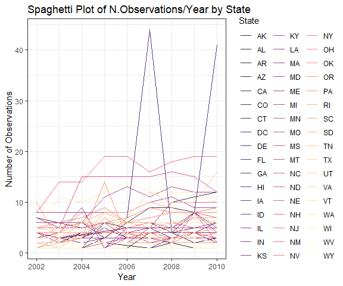
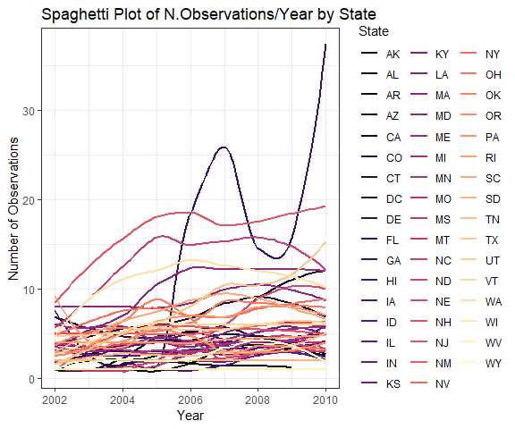
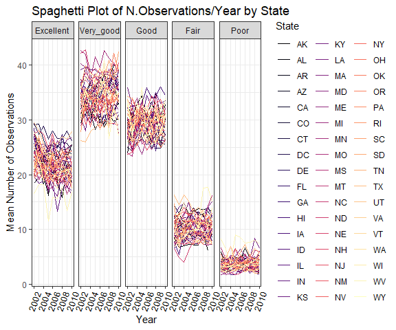

P8105 Homework 3
================
Quinton Neville
Due October 15th, 2018

Problem 1
=========

This problem uses the BRFSS data. DO NOT include this dataset in your local data directory; instead, load the data from the p8105.datasets package.

First, do some data cleaning:

format the data to use appropriate variable names; focus on the “Overall Health” topic include only responses from “Excellent” to “Poor” organize responses as a factor taking levels ordered from “Excellent” to “Poor” Using this dataset, do or answer the following (commenting on the results of each):

In 2002, which states were observed at 7 locations? Make a “spaghetti plot” that shows the number of locations in each state from 2002 to 2010. Make a table showing, for the years 2002, 2006, and 2010, the mean and standard deviation of the proportion of “Excellent” responses across locations in NY State. For each year and state, compute the average proportion in each response category (taking the average across locations in a state). Make a five-panel plot that shows, for each response category separately, the distribution of these state-level averages over time.

``` r
#Call data from p8105 library
data("brfss_smart2010")

#Read in & Clean brfss_smart2010
brfss.df <- brfss_smart2010 %>%
  janitor::clean_names() %>%
  filter(topic == "Overall Health") %>%
  select(year, locationabbr, locationdesc, response, data_value) %>%
  mutate(locationdesc = substring(locationdesc, 6) %>% toupper(),                         #Remove redundant state, std. chars 
         locationabbr = locationabbr %>% toupper,
         response = as.factor(response),
         response = forcats::fct_relevel(response, c("Excellent", "Very good", "Good", "Fair", "Poor"))) %>%
  rename(state = locationabbr, county = locationdesc, 
         proportion = data_value) 

#States Observed at 7 locations in 2002
states.obs7.2002 <- brfss.df %>%
  filter(year == 2002) %>%
  distinct(., state, county) %>%
  count(state) %>%
  mutate(seven.logical = ifelse(n == 7, TRUE, FALSE)) %>%
  filter(seven.logical == TRUE) %>%
  select(state) %>%
  apply(., 2, paste0, collapse = ", ")

#Spaghetti Plot Num. Locations in Each Year 2002-2010
state.obs.02.10 <- brfss.df %>%
  distinct(., year, state, county) %>%
  count(year,state) %>%
  ggplot(aes(x = year, y = n, colour = state)) +
  labs(
    x = "Year",
    y = "Number of Observations",
    title = "Spaghetti Plot of N.Observations/Year by State"
  ) +
  viridis::scale_color_viridis(
    option = "magma",
    name = "State", 
    discrete = TRUE
  ) + 
  theme(legend.position = "right")

line.gg.02.10 <- state.obs.02.10 + geom_line(alpha = 0.8)
smooth.gg.02.10 <- state.obs.02.10 + geom_smooth(alpha = 0.8, se = FALSE)
```



#### Data Overview and Cleaning

``` r
  brfss.df %>%
  filter(year == 2002 | year == 2006 | year == 2010 & 
         response == "Excellent") %>%
  group_by(year) %>%
  summarize(mean_excellent = mean(proportion, na.rm = T),
            sd_excellent = sd(proportion, na.rm = T)) %>%
  knitr::kable()
```

|  year|  mean\_excellent|  sd\_excellent|
|-----:|----------------:|--------------:|
|  2002|         20.00039|      12.060439|
|  2006|         19.97412|      11.855779|
|  2010|         21.46890|       4.250867|

``` r
#5 plot summary
prop.response.df <- brfss.df %>%
  spread(key = response, value = proportion) %>%                                          #Create col. vars for % responses
            janitor::clean_names() %>%
  group_by(year, state) %>%
  summarize(Excellent = mean(excellent, na.rm = T),
            Very_good = mean(very_good, na.rm = T),
            Good = mean(good, na.rm = T),
            Fair = mean(fair, na.rm = T),
            Poor = mean(poor, na.rm = T)) %>%
  gather(key = response, value = mean, Excellent:Poor) %>%
  mutate(response = forcats::fct_relevel(response, c("Excellent", "Very_good", "Good", "Fair", "Poor")))

response.st.yr <- prop.response.df %>%
  ggplot(aes(x = year, y = mean, colour = state)) +
  facet_grid(~response) +
    viridis::scale_color_viridis(
    option = "magma",
    name = "State", 
    discrete = TRUE
  ) + 
    labs(
    x = "Year",
    y = "Mean Number of Observations",
    title = "Spaghetti Plot of N.Observations/Year by State"
  ) +
  theme(legend.position = "right",
        axis.text.x = element_text(color = "black", 
        size = 10, angle = 420.69, hjust = 1) )

  
  
  
  

response.st.yr + geom_line()
```



#### Solutions

Problem 2
=========

This problem uses the Instacart data. DO NOT include this dataset in your local data directory; instead, load the data from the p8105.datasets package (it’s called instacart).

The goal is to do some exploration of this dataset. To that end, write a short description of the dataset, noting the size and structure of the data, describing some key variables, and giving illstrative examples of observations. Then, do or answer the following (commenting on the results of each):

How many aisles are there, and which aisles are the most items ordered from? Make a plot that shows the number of items ordered in each aisle. Order aisles sensibly, and organize your plot so others can read it. Make a table showing the most popular item aisles “baking ingredients”, “dog food care”, and “packaged vegetables fruits” Make a table showing the mean hour of the day at which Pink Lady Apples and Coffee Ice Cream are ordered on each day of the week; format this table for human readers (i.e. produce a 2 x 7 table).

#### Data Overview and Cleaning

#### Solutions

Problem 3
=========

This problem uses the NY NOAA data. DO NOT include this dataset in your local data directory; instead, load the data from the p8105.datasets package (it’s called ny\_noaa).

The goal is to do some exploration of this dataset. To that end, write a short description of the dataset, noting the size and structure of the data, describing some key variables, and indicating the extent to which missing data is an issue. Then, do or answer the following (commenting on the results of each):

Do some data cleaning. Create separate variables for year, month, and day. Ensure observations for temperature, precipitation, and snowfall are given in reasonable units. For snowfall, what are the most commonly observed values? Why? Make a two-panel plot showing the average temperature in January and in July in each station across years. Is there any observable / interpretable structure? Any outliers? Make a two-panel plot showing (i) tmax vs tmin for the full dataset (note that a scatterplot may not be the best option); and (ii) make a plot showing the distribution of snowfall values greater than 0 and less than 100 separately by year.

#### Data Overview and Cleaning

#### Solutions

``` r
#Histogram of Excellent Responses in 2002
hist.excel.02 <- brfss.df %>%
                 filter(year == 2002) %>%
                 ggplot() +
                 geom_histogram(aes(x = excellent),
                                color = "black", fill = "lightblue") +
                 geom_vline(xintercept = med.excel.2002, size = 2, colour = "red", linetype = "dashed") +
                 labs(
                   x = "Percentage Excellent Response (%)",
                   y = "Count",
                   title = "Histogram of % Excellent Response, 2002"
                 )
hist.excel.02

#Scatter of Prop. Excellent in NY County and Queens County, from 2002 to 2010
scatter.excel.02.10 <- brfss.df %>%
                       filter(county == "NEW YORK COUNTY" |
                              county == "QUEENS COUNTY") %>%
                       ggplot(aes(x = year, y = excellent, color = county)) +
                       geom_point(alpha = 0.9, size = 2) +
                       geom_line(alpha = 0.5, size = 0.5) +
                       labs(
                         x = "Year",
                         y = "Excellent Responses (%)",
                         title = "Scatter Plot of % Excellent Responses"
                       ) +
                       scale_color_manual(
                         name = "County",
                         values = c("Lightblue", "Purple"),
                         labels = expression("New York County", "Queens County")
                         )
scatter.excel.02.10
```

Appendix
========
