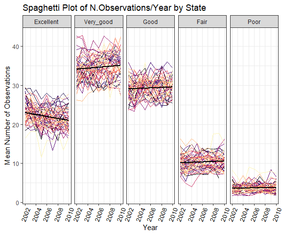

P8105 Homework 3
================
Quinton Neville
Due October 15th, 2018

Problem 1
=========

This problem focuses on the BRFSS data. In order to analyze these data, we formatted the data by standardizing variable names, filtered by observations concerning the "Overall Health" topic, selected those responses from "Excellent" to "Poor", cast these variables as factors and re-ordered them from "Excellent" to "Poor".

``` r
#Call data from p8105 library
data("brfss_smart2010")

#Read in & Clean brfss_smart2010
brfss.df <- brfss_smart2010 %>%
  janitor::clean_names() %>%
  filter(topic == "Overall Health") %>%
  select(year, locationabbr, locationdesc, response, data_value) %>%
  mutate(locationdesc = substring(locationdesc, 6) %>% toupper(),                         #Remove redundant state, std. chars 
         locationabbr = locationabbr %>% toupper,
         response = as.factor(response),
         response = forcats::fct_relevel(response, c("Excellent", "Very good", "Good", "Fair", "Poor"))) %>%
  rename(state = locationabbr, county = locationdesc, 
         proportion = data_value) 
```

We then completed/answered the following tasks/questions:

-   In 2002, which states were observed at 7 locations?
-   Make a “spaghetti plot” that shows the number of locations in each state from 2002 to 2010.
-   Make a table showing, for the years 2002, 2006, and 2010, the mean and standard deviation of the proportion of “Excellent” responses across locations in NY State.
-   For each year and state, compute the average proportion in each response category (taking the average across locations in a state). Make a five-panel plot that shows, for each response category separately, the distribution of these state-level averages over time.

#### Solutions

``` r
#States Observed at 7 locations in 2002
states.obs7.2002 <- brfss.df %>%
  filter(year == 2002) %>%
  distinct(., state, county) %>%
  count(state) %>%
  mutate(seven.logical = ifelse(n == 7, TRUE, FALSE)) %>%
  filter(seven.logical == TRUE) %>%
  select(state) %>%
  apply(., 2, paste0, collapse = ", ")
```

After filtering the data by those distinct state, county observations in 2002; we see that CT, FL, NC were each observed at 7 distinct locations in 2002.

``` r
#Spaghetti Plot Num. Locations in Each Year 2002-2010
state.obs.02.10 <- brfss.df %>%
  distinct(., year, state, county) %>%
  count(year,state) %>%
  ggplot(aes(x = year, y = n, colour = state)) +
  labs(
    x = "Year",
    y = "Number of Observations",
    title = "Spaghetti Plot of N.Observations/Year by State"
  ) +
  viridis::scale_color_viridis(
    option = "magma",
    name = "State", 
    discrete = TRUE
  ) + 
  theme(legend.position = "right")

line.gg.02.10 <- state.obs.02.10 + geom_line(alpha = 0.8)
smooth.gg.02.10 <- state.obs.02.10 + geom_smooth(alpha = 0.8, se = FALSE)
```

We then obtained linear and smoothed spaghetti plots of the number of locations in each state from 2002 to 2010. We see that most states are observed at fewer than 10 distinct locations each years, while a few outlying states are observed at almost 20 distinct locations per year and one state was observed at over 40 locations in 2007 and 2010. 

Next, we produced a a table showing, for the years 2002, 2006, and 2010, the mean and standard deviation of the proportion of “Excellent” responses across locations in NY State. We see that there was very little change in percent "Excellent" responses from 2002 to 2006, but a significant increase in the mean percentage of respondants ellecting an "Excellent" response to "overall Health" in 2010, with a significant reduction in response variability.

``` r
  brfss.df %>%
  filter(year == 2002 | year == 2006 | year == 2010 & 
         response == "Excellent") %>%
  group_by(year) %>%
  summarize(mean_excellent = mean(proportion, na.rm = T),
            sd_excellent = sd(proportion, na.rm = T)) %>%
  knitr::kable()
```

|  year|  mean\_excellent|  sd\_excellent|
|-----:|----------------:|--------------:|
|  2002|         20.00039|      12.060439|
|  2006|         19.97412|      11.855779|
|  2010|         21.46890|       4.250867|

Lastly, for each year and state, we computed the average proportion in each response category (taking the average across locations in a state). Below, we obtained a five-panel plot that shows, for each response category separately, the distribution of these state-level averages over time. We observed a relatively stable temporal distribution of approximately 20-30% "Excellent", 30-40% "Very Good", 25-35% "Good", 5-15% "Fair", and 2.5-7.5% "Poor" responses by state per year. Additionally, the variability in proportion state responses per year in the "Excellent" - "Good" categories was quite high, while the variability for "Fair" and "Poor" responses was significantly lower.

``` r
#5 plot summary
prop.response.df <- brfss.df %>%
  spread(key = response, value = proportion) %>%                                          #Create col. vars for % responses
            janitor::clean_names() %>%
  group_by(year, state) %>%
  summarize(Excellent = mean(excellent, na.rm = T),
            Very_good = mean(very_good, na.rm = T),
            Good = mean(good, na.rm = T),
            Fair = mean(fair, na.rm = T),
            Poor = mean(poor, na.rm = T)) %>%
  gather(key = response, value = mean, Excellent:Poor) %>%
  mutate(response = forcats::fct_relevel(response, c("Excellent", "Very_good", "Good", "Fair", "Poor")))

response.st.yr <- prop.response.df %>%
  ggplot(aes(x = year, y = mean, colour = state)) +
  facet_grid(~response) +
    viridis::scale_color_viridis(
    option = "magma",
    name = "State", 
    discrete = TRUE
  ) + 
    labs(
    x = "Year",
    y = "Mean Number of Observations",
    title = "Spaghetti Plot of N.Observations/Year by State"
  ) +
  theme(legend.position = "none",
        axis.text.x = element_text(color = "black", 
        size = 10, angle = 430, vjust = .5) )

  
  
  
  

response.st.yr + geom_line()
```



Problem 2
=========

This problem focuses on the Instacart data, found in the P8105 Github Repository.

First, we will provide a short description of the dataset, noting the size and structure of the data, describing some key variables, and giving illustrative examples of observations. Then we will do or answer the following:

-   How many aisles are there, and which aisles are the most items ordered from?
-   Make a plot that shows the number of items ordered in each aisle. Order aisles sensibly, and organize your plot so others can read it.
-   Make a table showing the most popular item aisles “baking ingredients”, “dog food care”, and “packaged vegetables fruits”.
-   Make a table showing the mean hour of the day at which Pink Lady Apples and Coffee Ice Cream are ordered on each day of the week; format this table for human readers (i.e. produce a 2 x 7 table).

``` r
#Load data from p8105 datasets
data("instacart")
#Pull the dimmensions
dim.insta.cart <- dim(instacart)


insta.cart.df <- instacart %>%
  janitor::clean_names() 

#Summary of Customer Visits
sum.df <- insta.cart.df %>%
  janitor::clean_names() %>%
  group_by(order_id, user_id) %>%
  summarize(
    n_items = max(add_to_cart_order),
    n_unique_aisles = aisle_id %>% unique() %>% length(),
    n_unique_dept = department %>% unique() %>% length(),
    n_days_last_order = unique(days_since_prior_order),
    prct_reorder = mean(reordered),
    order_num = unique(order_number)
    ) %>% gather(key = Customer_Stats, value = count, n_items:order_num) %>%
  group_by(Customer_Stats) %>%
  summarize(
    median = median(count, na.rm = T),
    mean = mean(count, na.rm = T),
    variance = sd(count, na.rm = T)^2,
    max = max(count),
    min = min(count)
    )

#Number of Unique products bought   
unique.products <- insta.cart.df %>% distinct(., product_id) %>% nrow()
```

Data Overview
=============

Upon intial exploration, the Instacart data set contains 1384617 observations in 15 variables, where each observation describes an individual grocery item purchase made via instacart and the variables describe features of each purchase. Such features include product name, id, aisle of purchase, department of purchase, purchase day of the week, purchase time, whether or not the purchase was a reorder, customer id, purchase number by customer order, and visit number by customer. Overall, 39123 unique products were purchased in these data, and on average, each customer purchased 11 items, of which 60.25% were reordered, and visited an average of 8 unique aisles from 5 unique departments. The median customer was shopping at Instacart again 17 days after their previous order, for their 10th time. However, there existed a group of heavy outlying customers who were on nearly their 100th visit, implying most people use the service regularly but infrequently while a select group use it both regularly and frequently. Additionally, the number of items purches per order, days since last order, and the order number, elicited a high degree of variability amongst customers. (Full table found below)

| Customer\_Stats      |      median|        mean|     variance|  max|  min|
|:---------------------|-----------:|-----------:|------------:|----:|----:|
| n\_days\_last\_order |  15.0000000|  17.0498594|  113.9947398|   30|    0|
| n\_items             |   9.0000000|  10.5527593|   62.9300578|   80|    1|
| n\_unique\_aisles    |   7.0000000|   7.5510750|   24.9964482|   44|    1|
| n\_unique\_dept      |   5.0000000|   4.8806942|    6.9838302|   16|    1|
| order\_num           |  10.0000000|  16.6039372|  277.5914945|  100|    4|
| prct\_reorder        |   0.6315789|   0.6024722|    0.0941036|    1|    0|

As an illustrative example of what these Instacart data actually describe, a group of purchase observations from customer 310's 100th visit tell us that this customer ordered 4 items (Natural Vanilla Ice Cream, Whipped Light Cream, Original, Complete ActionPacs Lemon Burst Dishwasher Detergent, Classic Vanilla Coffee Creamer), of which Classic Vanilla Coffee Creamer was a reorder. These purchases were made from the ice cream ice, cream, dish detergents, other aisles in the frozen, dairy eggs, household, other departments. Additionally, these purchases took place on Tuesday at 9 a.m. and it had been 4 days since their last order. Together, this customer's total order comprised 4 purchase observations in the Instacart dataset.

#### Solutions

``` r
#Top 5 Aisles
n.unique.aisles <- insta.cart.df %>% distinct(., aisle) %>% nrow()
top.5.aisles.df <- insta.cart.df %>%
  count(aisle) %>% arrange(desc(n)) %>% slice(1:5) %>%
  select(aisle)
```

After some small data manipulations, we obtained that there exist 134 distinct aisles in the Instacart data. Of these, fresh vegetables, fresh fruits, packaged vegetables fruits, yogurt, packaged cheese were the top 5 aisles from which products were ordered. As these are highly perishable items, it makes some sense that these are the items ordered most frequently as they go bad the fastest. Below, we obtained an exhaustive barplot of the number of items ordered by aisle.

``` r
#Histogram of Order in each aisle
aisle.order.df <- insta.cart.df %>%
  count(aisle, department) %>% arrange(desc(n)) %>%
  mutate(aisle = as.factor(aisle)) %>%
  mutate(aisle = forcats::fct_reorder(aisle, n))

hist.aisle.orders <- aisle.order.df %>%
  ggplot(aes(x = aisle, y = n)) +
  geom_bar(stat = "identity", width = 1, fill = "lightblue", colour = "black") +
    coord_flip() +
  labs(
    x = "Aisle",
    y = "Number of Orders",
    title = "Number of Orders by Aisle"
  ) +
    theme(legend.position = "right",
        axis.text.y = element_text(color = "black", 
        size = 10,  hjust = 1) ) 

hist.aisle.orders
```


Next, we obtained a table of the most popular items ordered from the “baking ingredients”, “dog food care”, and “packaged vegetables fruits” aisles, respectively. Light Brown sugar is a very common baking ingredient, and makes sense that it would be the most purchased baking ingredient. The specific dog treats purchased most in the dog food care aisle would not be immediately obvious, but apparently these were the most popular dog food treat. Lastly, spinach is a very popular vegetable purchase amongst current younger demographics prone to ordering groceries over the internet, so the fact that spinach was the most popular purchase in the packaged vegetables aisle is not wholly unsurprising. (Table found below)

``` r
#Most popular item in “baking ingredients”, “dog food care”, and “packaged vegetables fruits”
pop.item.aisle.df <- insta.cart.df %>%
  filter(aisle == "baking ingredients" | 
         aisle == "dog food care" | 
         aisle == "packaged vegetables fruits") %>%
  count(product_name, aisle) %>%
  group_by(aisle) %>%
  summarize(
    'Most Popular Product' = product_name[which.max(n)],
    'Number Bought' = max(n)
  ) %>%
  rename(Aisle = aisle)
pop.item.aisle.df %>%
  knitr::kable()
```

| Aisle                      | Most Popular Product                          |  Number Bought|
|:---------------------------|:----------------------------------------------|--------------:|
| baking ingredients         | Light Brown Sugar                             |            499|
| dog food care              | Snack Sticks Chicken & Rice Recipe Dog Treats |             30|
| packaged vegetables fruits | Organic Baby Spinach                          |           9784|

Lastly, we obtained a table of the mean hour of the day (12 hour, a.m./p.m.), per each day of the week, that both Pink Lady Apples and Coffee Ice Cream are purchased. Here we assumed that for days coded (0-6), that 0 corresponded to Sunday, and the rest followed suit until 6 - Saturday. We noticed that on average, these two items were most often purchased in the early afternoon, but significantly later on Wednesdays than any other day of the week. (Table found below)

``` r
#Mean hour Pink Lady Apples and Coffee Ice Cream are ordered on each day of the week; format this table for human readers
#User function to change mean time (decimal, 24 hour) to 12 hour time (hour:min a.m./p.m.)
#Inputs numeric vector, outputs character vector of same length
dec.to.min <- function(x){
  for (i in 1:length(x)) {  #loop through each vector element
      y <- as.character(x[i])    #cast as character
      y1 <- sapply(strsplit(y, "[.]"), `[`, 1) %>% as.numeric()  #split on decimal,pull hour, cast as numeric
      y2 <- substring(x[i],3) %>% as.numeric()*60 #pull decimal, convert to minutes
    if (y2 < 10) {
        y2 <- paste0(0,round(y2))  #if less than 10, add "0_" and round to integer
    } else {
        y2 <- round(y2) #round to integer
      }
    if (y1 >= 13) {
      y1 <- y1 - 12   #convert to 24 hour if p.m.
      x[i] <- paste(y1, y2, sep = ":") %>%  #replace ith entry with "__:__ p.m." if hour > 13
          paste(., "p.m.")
    } else if (y1 == 12) {
      x[i] <- paste(y1, y2, sep = ":") %>% # #replace ith entry with "__:__ p.m." if hour = 12
          paste(., "p.m.")
    } else {
      x[i] <- paste(y1, y2, sep = ":") %>% #replace ith entry with "__:__ a.m." if hour < 12.
          paste(., "a.m.")
    }
  }
  return(x)
}


  insta.cart.df %>%
  filter(product_name == "Pink Lady Apples" |
         product_name == "Coffee Ice Cream") %>%
  group_by(order_dow) %>%
  summarize(
    mean_hour = mean(order_hour_of_day)
  ) %>%
  mutate(
    mean_hour = dec.to.min(mean_hour),
    order_dow = c("Sunday", "Monday", "Tuesday", "Wednesday",
                  "Thursday", "Friday", "Saturday")
  ) %>%
  rename('Order Day of the Week' = order_dow,
         'Mean Time of Order' = mean_hour) %>%
  knitr::kable()
```

| Order Day of the Week | Mean Time of Order |
|:----------------------|:-------------------|
| Sunday                | 1:36 p.m.          |
| Monday                | 12:10 p.m.         |
| Tuesday               | 12:50 p.m.         |
| Wednesday             | 2:41 p.m.          |
| Thursday              | 1:10 p.m.          |
| Friday                | 12:39 p.m.         |
| Saturday              | 1:15 p.m.          |

Problem 3
=========

This problem focuses on the NY NOAA data. To begin, we will do some data cleaning, creating separate variables for year, month, and day, and standardizing observation units for temperature, precipitation, and snowfall (mm, degrees Celsius), respectively.

``` r
#Load Data from P8105 git repo
data("ny_noaa")

#Dimensions(original)
original.dim.noaa <- dim(ny_noaa)

ny.noaa.df <- ny_noaa %>%
  janitor::clean_names() %>%
  mutate(
    year = date %>% as.character() %>% strsplit(., "[-]") %>% sapply(., `[`, 1) %>% as.numeric(),  #String pull year
    month = date %>% as.character() %>% strsplit(., "[-]") %>% sapply(., `[`, 2) %>% as.numeric(), #String pull month
    day = date %>% as.character() %>% strsplit(., "[-]") %>% sapply(., `[`, 3) %>% as.numeric(),   #String pull day
    month =  recode(month, '1'  = "January", '2' = "February", '3' = "March", '4' = "April",       #Factor, relevel month by name
         '5' = "May", '6' = "June", '7' = "July", '8' = "August", '9' = "September",
         '10' = "October", '11' = "November", '12' = "December") %>% 
    as.factor() %>% forcats::fct_relevel(., month.name),
    tmax = tmax %>% as.numeric()/10, #degrees c     
    tmin = tmin %>% as.numeric()/10, #degrees c
    prcp = prcp/10 #mm
  ) %>%
  select(id, year, month, day, everything(), -date) 

#Missing Data
missing.prct <- ny.noaa.df %>%
  select(prcp:tmin) %>%
  apply(., 2, is.na) %>%
  apply(., 2, mean) %>%
  round(., 4) * 100

na.omit.prct <- ny.noaa.df %>%
  na.omit() %>% nrow()/original.dim.noaa[1]*100
```

Next, we will provide a short description of the dataset, noting the size and structure of the data, describing some key variables, and discuss the extent to which missing data is an issue. Then, we will do or answer the following:

-   For snowfall, what are the most commonly observed values? Why?
-   Make a two-panel plot showing the average temperature in January and in July in each station across years. Is there any observable / interpretable structure? Any outliers?
-   Make a two-panel plot showing (i) tmax vs tmin for the full dataset (note that a scatterplot may not be the best option); and (ii) make a plot showing the distribution of snowfall values greater than 0 and less than 100 separately by year.

#### Data Overview

Considering the NYC NOAA data, there were 2595176 weather station observations in 7 variables. Here, each observation is a report from an individual NYC weather station to the NOAA, and the variables describe the year, month, and day of observation, the precipitation, snowfall, and snow depth in millimeters, as well as the maximum and minimum temperature in degrees Celsius. From the original data, precipitation, snowfall, snow depth, max temp., and min. temp are each missing to varying degrees (5.62%, 14.69%, 22.8%, 43.71%, 43.71%), respectively. Missing precipitation for about 5% of the data is not a huge problem, but for the remaining variables, the high degree to which the information is missing does not allow us to assume that these data were missing at random, and severly limits the degree to which we could draw inferential conclusions from the data.

#### Solutions

``` r
#Most common snowfall count
most.obs.snow <- ny.noaa.df %>% na.omit() %>%
  mutate(snow = snow %>% as.character()) %>%  #Zero, for obvious reasons, it doesn't snow that often in nyc
  count(snow) %>% arrange(desc(n))  %>%
  slice(1:5) %>%
  rename('Snowfall (mm)' = snow,
         'Number of Observations' = n)
```

With respect to snowfall, we obtained that the most common observation by far was 0mm of snowfall reported by a NYC weather station. This is not wholly unsurprising as it does not snow that frequently in NYC, even during the winter months. However, it is interesting to note that the next most common observation was 25mm of snowfall, which is not a trivial amount of snowfall. A table of the 5 most common snowfall observations can be found below.

| Snowfall (mm) |  Number of Observations|
|:--------------|-----------------------:|
| 0             |                 1112758|
| 25            |                   15809|
| 13            |                   12460|
| 51            |                    9252|
| 5             |                    5669|

Next, we obtained a two panel plot for the average maximum temperature in degrees Celsius reported by each station from 1981-2010, for the months of January and July, respectively. We observed that the average maximum temperature was much more variable in January than in July each year, meaning that the average station reported a much wider range of maximum temperatures (more outliers) in the winter than in the summer within each year. Additionally, from year to year, the average maximum temperature reported varied much more in the winter than in the summer, with a small but significant increase in overall average maximum temperature across all stations in January and little to no observably significant change in July from 1981-2010. This would suggest that average maxmimum temperatures reported across all stations were much more variable and increased in January from 1981-2010, while there was much less variability and relatively little change in July over the same time period.

``` r
#Two panel plot of avg max temp in January and July by station over the years
gg.avg.temp <- ny.noaa.df %>%
  na.omit() %>% filter(month == "January" | month == "July") %>%
  group_by(id, year, month) %>%
  summarize(
    avg_max_temp = mean(tmax) %>% round(., 3)
  ) %>%
  ggplot(aes(x = year, y = avg_max_temp, colour = id)) +
    facet_grid(~month) +
    viridis::scale_color_viridis(
    option = "magma",
    name = "Station", 
    discrete = TRUE
  ) + 
    labs(
    x = "Year",
    y = expression(paste("Average Max Temperature ( ", degree ~ C, ")")),
    title = "Plots of Avg Max Temp/Year by Station, (Jan., July)"
  ) +
  theme(legend.position = "none",
        axis.text.x = element_text(color = "black", 
        size = 10, angle = 45, vjust = .5)) +
  scale_x_continuous(breaks = seq(1980, 2010, 4))

gg.avg.temp + 
  geom_line(alpha = 0.3) +
  geom_smooth(method = "lm", colour = "black", size = 0.75, alpha = 0.9)
```


Lastly, we created a two panel plot showing the (1) Density of minimum and maximum temperatures reported across all stations over all years in a binned hex-plot and (2) Distribution of snowfall between 0 and 100 mm each year from 1981-2010. We observed from panel (1), that the highest concentration of minimum and maximum temperatures reported fell between -5 to 25 degrees at maximum and -20 to 20 degrees at minimum, with an entire range of aboute -40 to 40 for both (with a few warmer outliers for maximum temperature). With respect to panel (2), we observed that the distribution of snowfall from the years 1981-2010 did not vary significantly from year to year. Additionally, each year the distribution exhibited a heavy right skew, with a majority of stations reporting between 0-25mm and a few clusterings around 50 and 80mm each year.

``` r
# (i) tmax vs tmin for the full dataset (note that a scatterplot may not be the best option)
  gg.min.max <- ny.noaa.df %>%
  na.omit() %>% ggplot(aes(x = tmin, y = tmax)) +
    viridis::scale_fill_viridis(
    option = "magma",
    name = "Count", 
    discrete = FALSE
  ) + theme(
    legend.text = element_text(size = 10, angle = 45, hjust = 1),
    legend.title = element_text(size = 12, vjust = 1)
  ) +
  labs(
    x = expression(paste("Minimum Temperature ( ", degree ~ C, ")")),
    y = expression(paste("Maximum Temperature ( ", degree ~ C, ")")),
    title = "Max. and Min. Temp., NYC NOAA"
  ) +
  geom_hex(bins = 42) +
  scale_y_continuous(breaks = c(seq(-60, 60, 20)))
  
#(ii) make a plot showing the distribution of snowfall values greater than 0 and less than 100 separately by year.
gg.snow.year <- ny.noaa.df %>%
  na.omit() %>% filter(snow < 100 & snow > 0) %>%
  mutate(year = as.factor(year)) %>%
ggplot(aes(x = snow, y = year)) + 
  geom_density_ridges(fill = "lightblue", scale = 1) +
    theme(legend.position = "none") +
  labs(
    x = "Snowfall (mm)",
    y = "Year",
    title = "Snowfall by Year, NYC NOAA"
  ) +
  scale_x_continuous(breaks = seq(0, 100, 20))

  #Arrange in nice 2 panel grid
grid.arrange(gg.min.max, gg.snow.year, nrow = 1, ncol = 2)
```

    ## Picking joint bandwidth of 4.24


